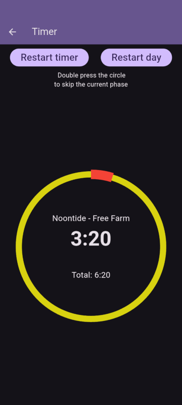
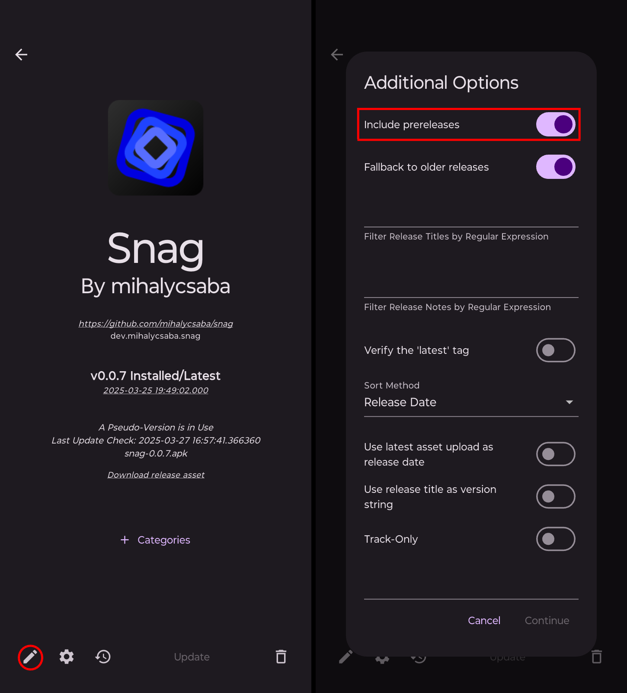

#  Farer Companion

Timer application for Elden Ring Nightreign. Available for Android, Windows, Linux. Made with [Flutter 🩵](https://flutter.dev/).

## Screenshot

## Features

- Double press the timer to skip to the next phase
- Vibration before the next phase on Android
- Customize the time before the vibration
- Keeps the screen awake on the timer page

## Installation

Download from [Github](https://github.com/mihalycsaba/farer_companion/releases/latest)

### Windows
Until I set up signing for the exe, you need to unblock the exe in the properties.

## Updating

### Android

You can use [Obtainium](https://github.com/ImranR98/Obtainium) for updates.

Copy the repository URL `https://github.com/mihalycsaba/farer_companion` into the Obtainium Add App page.

You can get prerelease versions with Obtainium by enabling `Include prereleases`.

## Build

The app should always be built with the latest stable version of Flutter.

Latest release was built with Flutter version: `3.32.4`

## Contributing

Do it with updated plugins `flutter pub upgrade`

Run release.sh to test if it builds.

Explain your pull requests. Try to create separete PRs for each feature or fix.
